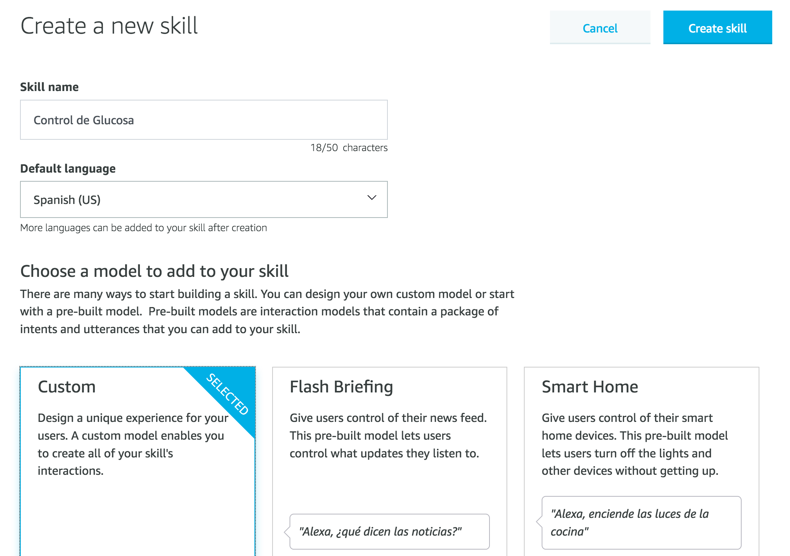
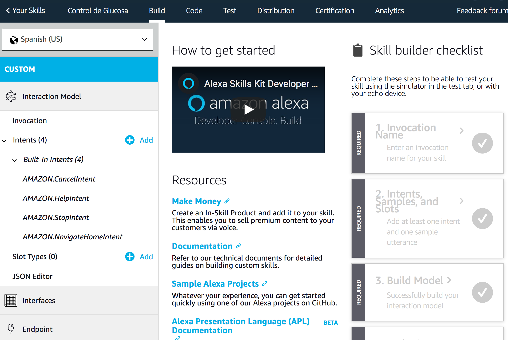
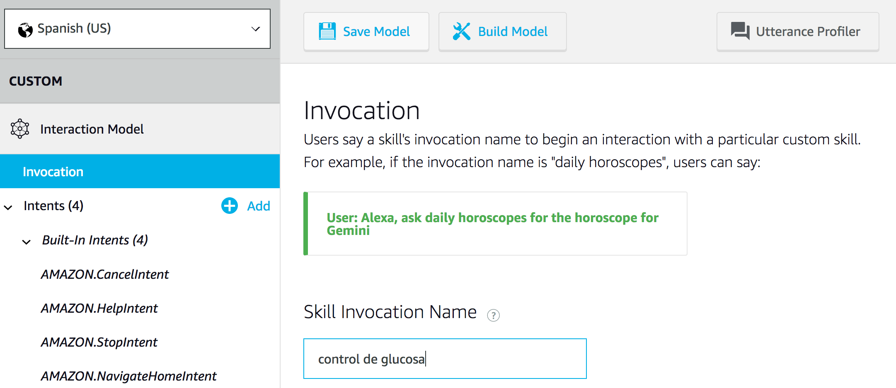
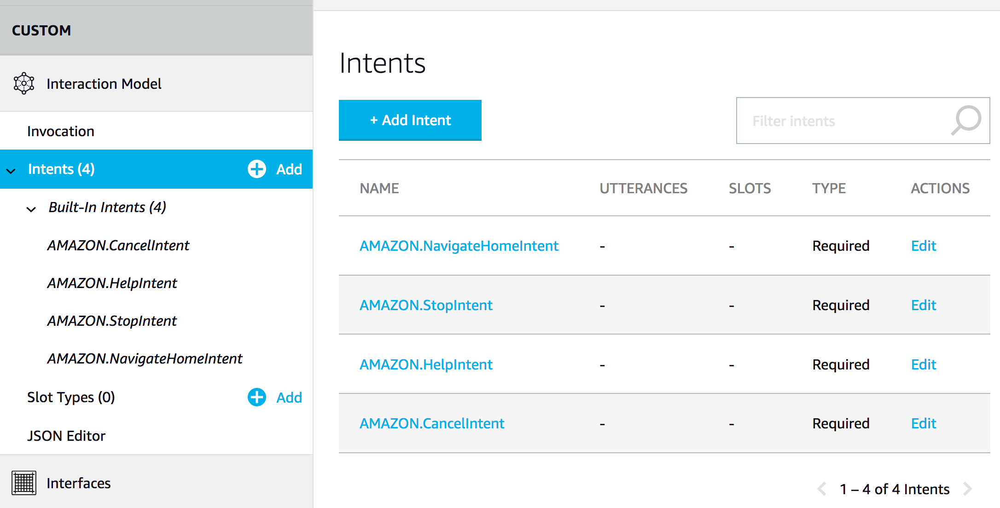
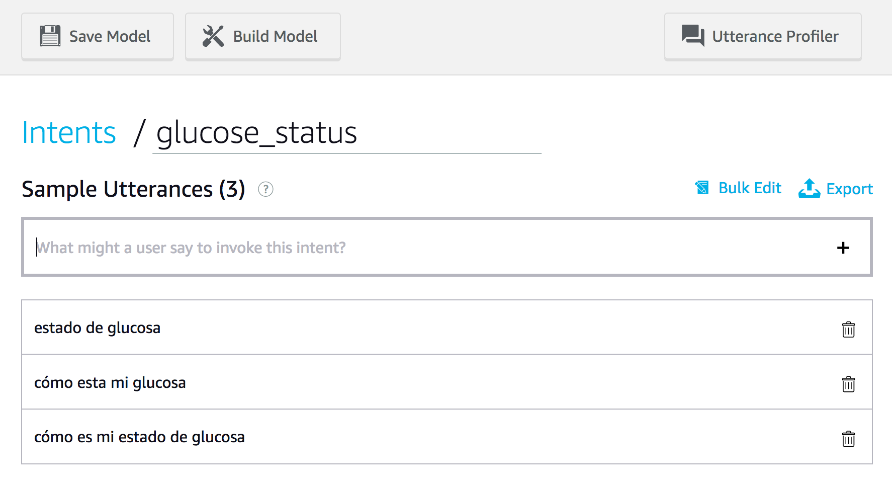
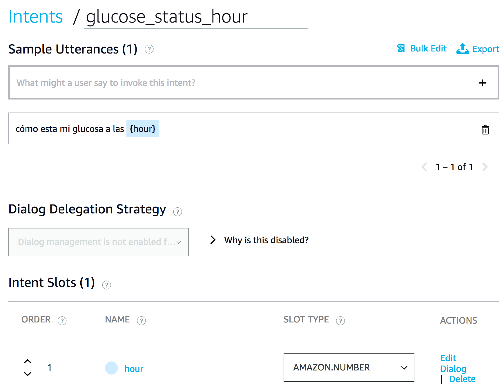
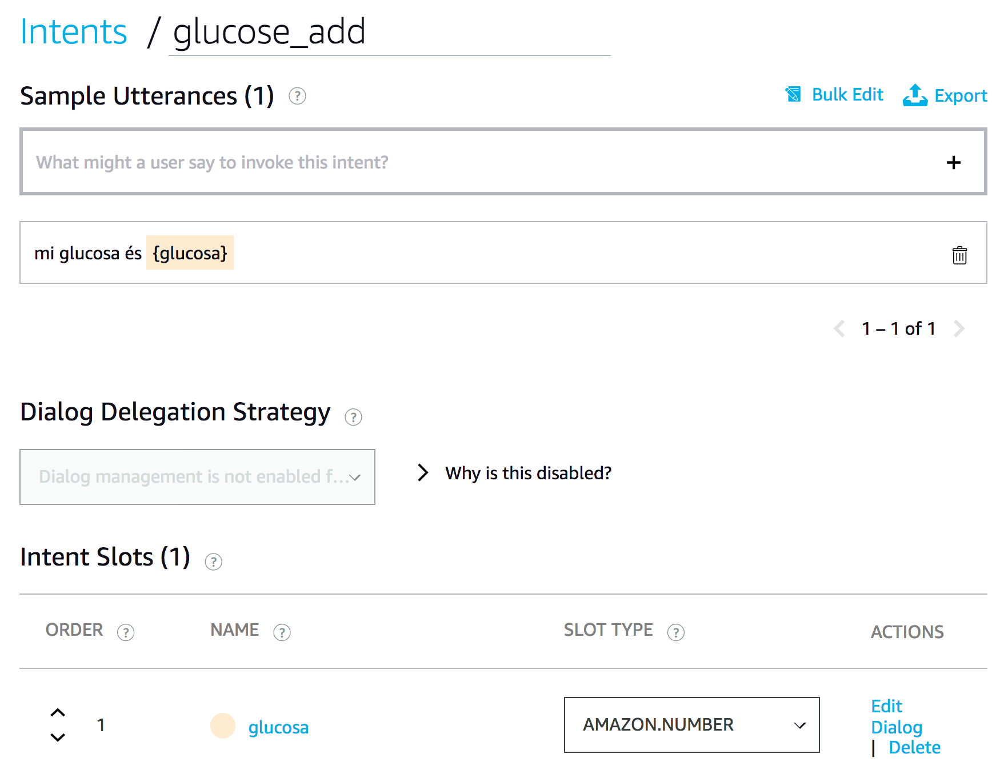
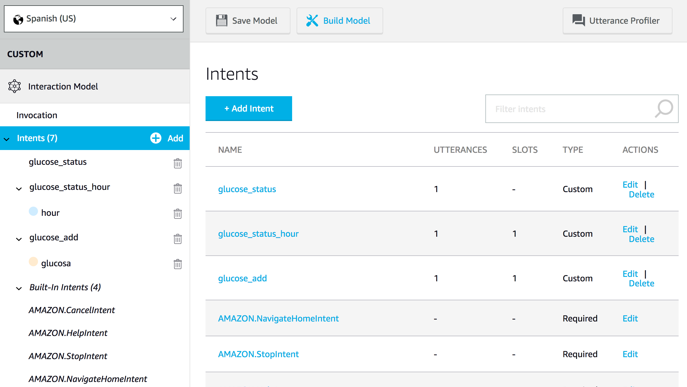
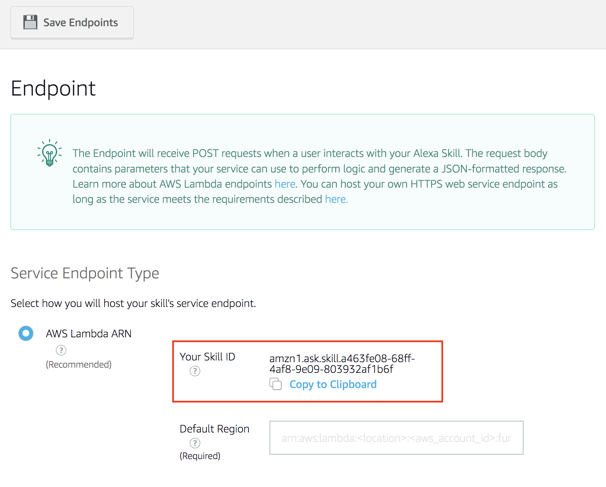

# Example 07 - Alexa Skill for Glucose Database

Now let's have some fun doing an Alexa Skill to interact with your glucose data.

### 1. Go to developer.amazon.com 

 

### 2. Click Login, create a new login if you don't have Amazon Developer account. This account is different from AWS account!

 

### 3. Click "Your Alexa Consoles", "Skills"

 

### 4. Click "Create Skill"

 

### 5. Name your skill and choose the language 

 

### 6. Now we are ready to start the skill development!

 

### 7. Let's configure the Invocation Name and click "Save Model". This will be used like: "Alexa, abrir Control de Glucosa":

### 8. Now we need to setup our intents, intents represents a communication between Alexa and the user. Intents have a name and also one or more utterances (phrases, expression). Click "+Add Intent" to setup our first intent.

### 9. glucose_status 

* This intent is simple (without parameters / slot!) and will bring the average glucose.

### 10. glucose_status_hour. 

* This intent will has a slot / parameter called "{hour}" and you must setup the slot as AMAZON.NUMBER

### 11. glucose_add. 

* This intent allows the user to make a new glucose input and it has a slot as well called glucosa that must be configured as AMAZON.NUMBER

### 12. Now we can start to build the model and then finish to configure the Alexa Skill endpoint. 

* Click "Save" and "Build Model" (it will take some seconds!)

### 13. Now click "Endpoint" to configure your Lambda Function and choose Lambda Function as host service endpoint. Copy the the Alexa Skill ID:

### 14. Now we completed to configure our Alexa Skill but we need a Lambda NodeJS code that will be the back-end function for the skill. 

* Let's configure the /w07-alexa-skill/serverless.yml with the right Alexa Skill ID, DynamoDB table name and also the user name:

